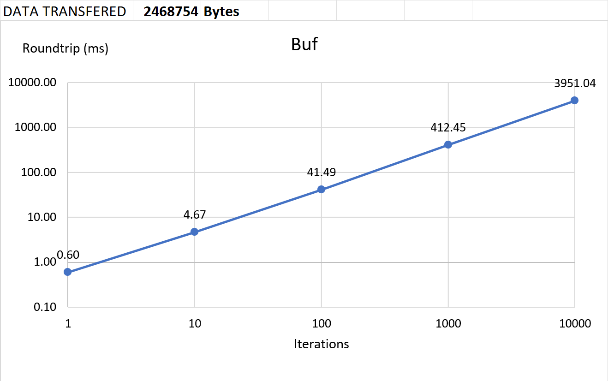
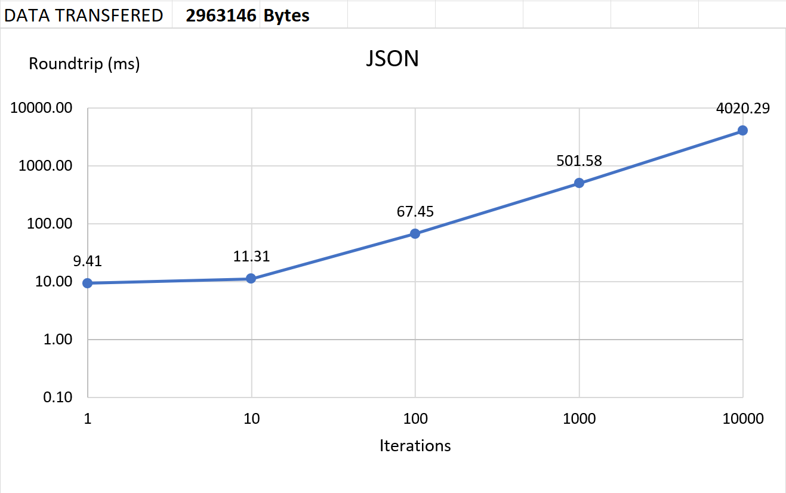
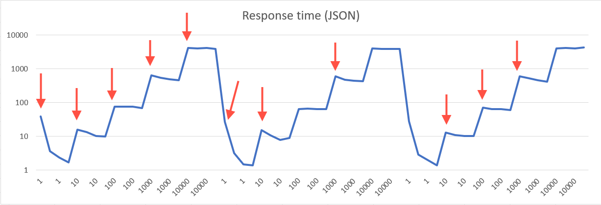
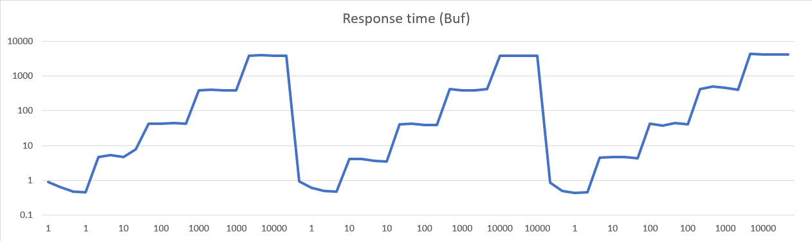

# Table of Contents
- [Introduction](#introduction)
- [Theory](#theory)
- [Encoding](#encoding)
  - [Override](#override)
  - [Functions](#functions)
- [Decoding](#decoding)
  - [Override](#override-1)
  - [Functions](#functions-1)
- [Example BufferObject](#example-bufferobject)
- [BufferObject creation](#bufferobject-creation)
- [Benchmarks vs JSON](#benchmarks-vs-json)
  - [Test class](#test-class)
  - [Results](#results)
  - [Thoughts](#thoughts)
- [Running node with --trace-opt](#running-node-with---trace-opt)
- [Future](#future)
- [External resources](#external-resources)

# Introduction

**Proof of Concept**

This repository represents a binary communication between a client and a server.
It is based upon JavaScript's `ArrayBuffer`, where each message follows a pattern:

`Uint32 NextDataLength` | `SpecifiedDataFormat Data` | `Uint32 NextDataLength` | ...

Where `SpecifiedDataFormat` is a `TypedArray` (view of the buffer), for example:
* `Uint8Array`,
* `Int32Array`,
* `Float64Array`,
* `...`

This approach requires a bit of setup, namely to specify how each type is encoded
and decoded.

# Theory

Encoding basic types is rather simple:

* `string` - each `char` in JavaScript is 2 bytes. Take the length of the string and double it.
* `number` - it's either 4 or 8 bytes (32-bit `int` or 64-bit `float`).


  Differing what `TypedArray` to use comes from bit shifting the number by 0. \
  If it is the same as the original value, then it surely is a 32-bit `int`, \
  otherwise the following behavior can be observed:

    * Positive value outside of 32-bit integer (2^31):
        * `Math.pow(2, 31)` = 2147483648
        * `Math.pow(2, 31) >> 0` = -2147483648
    * Negative value outside of 32-bit integer (-2^40):
        * `-Math.pow(2, 40)` = -1099511627776
        * `-Math.pow(2, 40) >> 0` = 0
    * Floating point number:
        * `32.6725418 >> 0` = 32
        * `-15.88888 >> 0` = -15

* `boolean` is rather unfortunate, as only 1 bit is required to represent it. \
  Here we need to allocate a whole byte for it, which could fit 8 boolean properties.\
  If an object declares whole bunch of booleans, the optimization could come from \
  counting them and setting values in the 1-byte buffer.

* `object` - this PoC forbids using POJO objects. Instead it's required to use \
  classes inheriting from `BufferObject`, which can encode and decode themselves.
  (TODO)

Each of the above is preceded by `Uint32` (4 bytes) that represent the length of the data.

# Encoding

The algorithm follows a class-specific order of encoding, as well as the types
that it should encode values from.

## Override

```typescript
BufferObject.toBuffer(): ArrayBuffer
```

Calling `toBuffer` on a class that doesn't implement it directly will
result in a `TypeError`.

## Functions

- `BufferObject.encodeNumber(name)`
- `BufferObject.encodeString(name)`
- `BufferObject.encodeBoolean(name)`
- `BufferObject.encodeBufferObject(name)`


Where `name` is the class property that it should encode from.

- `BufferObject.encode(): ArrayBuffer`,

Which returns a created ArrayBuffer with the instance data.
It should be the last step in the sequence, as it triggers the encoding algorithm
in the base class. \
*Note*: the derived class must return the encoded result `ArrayBuffer` from
the overriden `toBuffer` function to work correctly.

# Decoding

The algorithm follows a class-specific order of decoding, as well as the types
that it should decode values to.

## Override

```typescript
BufferObject.fromBuffer(buffer: ArrayBuffer): void
```

Calling `fromBuffer` on a class that doesn't implement it directly will
result in a `TypeError`.

## Functions
- `BufferObject.decodeNumber(name)`
- `BufferObject.decodeString(name)`
- `BufferObject.decodeBoolean(name)`
- `BufferObject.decodeBufferObject(name)`

Where `name` is the class property that it should decode into.

- `BufferObject.decode(buffer: ArrayBuffer)`,

Where buffer is an `ArrayBuffer`. It should be the last step in the sequence,
as it triggers the decoding algorithm in the base class.


# Example BufferObject

```javascript
export class User extends BufferObject {
    id;
    firstName;
    secondName;

    constructor(id, firstName, secondName) {
        super();
        this.id = id;
        this.firstName = firstName;
        this.secondName = secondName;
    }

    // REQUIRED to encode properly!
    toBuffer() {
        this.encodeNumber("id");
        this.encodeString("firstName");
        this.encodeString("secondName");
        return this.encode();
    }

    // REQUIRED to decode properly!
    fromBuffer(buffer) {
        this.decodeNumber("id");
        this.decodeString("firstName");
        this.decodeString("secondName");
        this.decode(buffer);
    }
}
```
Under the hood, each `this.encodeXYZ(...)` and `this.decodeXYZ(...)` call adds
an encoding or a decoding step respectively, which won't be executed until
`this.encode()` or `this.decode(buffer)` is called.

# BufferObject creation

Creating such object can be done in two ways:
```javascript
DerivedClass.prototype.fromBuffer(buffer);
```
or
```javascript
let user = new DerivedClass().fromBuffer(buffer);
```

Where `DerivedClass` extends `BufferObject`.

*Note*: you should not call `encode` or `decode` directly from outside the class.

# Benchmarks vs JSON

**Preambule**: \
The results below should be taken with a grain of salt. This is by
no means a reliable representation of the algorithm nor its counterpart,
and the benchmarking environment is not perfect.
After all, this is a "for fun" side project of implementing a binary web
communication, not an academic paper on in-depth performance metrics 🤓.
___

The test data represented in charts below consists of 3 cold-start runs of the
application, where each benchmark would go over 5 scenarios:

| iterations |
|------------|
| 1          |
| 10         |
| 100        |
| 1000       |
| 10000      |

Each scenario sends a `POST` request and waits for a response `iterations`
times __sequentially__. Every request is decoded on the server, then the server
returns a response. That's where the term _roundtrip_ comes from in the results.
Server responds with a number of received `Content-Length`. Sum of all responses
is taken into the _DATA TRANSFERED_ column.

## Test class
- `id: number`
- `firstName: string`
- `secondName: string`

## Results
| | BufferObject | JSON |
|-|--------------|------|
| chart |  |  |
| Data Transfered | 2,468,754 bytes | 2,963,146 bytes |
| Ratio **(JSON = 100%)** | ~83.4% | 100% |


The response time of BufferObject grows linearly to the amount of
sequential requests made, and no "warmup time" is observed, contrary
to JSON solution, of which the average response time is very high for initial
requests, then it falls slightly.

|     |      |
|-----|------|
| It is not by much, but enough to be noticeable in the test data: |  |
| Whereas ObjectBuffer results show virtually flat response time curve for each given scenario (1, 10, 100, ...) |  |

## Thoughts

First off: Hooray! At least it isn't slower 😅 \
And it manages to be quite successful in reducing the data transfer.
I imagine the more fields a class has, the better the ratio is.

It could reach even smaller transfers provided the `NextDataLength`
could be of variable length. It could be achieved with custom encoding, such as:
- Start with 1 byte,
- if the last bit is 1, continue reading,
- if the last bit is 0, start reading data.

For example, a `Uint32` would hold 28 bits of information.
The ratio would be even better for longer data sets. \
That would also resolve the problem of a maximum length of a single data node,
which now figures at 2<sup>32</sup> bits.

# Running node with --trace-opt

Executing 50k calls for each data format shows
that around every ~300-400 JSON endpoint calls, the V8 runs
various optimizations (like Inline Caches **[[1]](#External-resources)**), upto ~12000th call,
then does one more optimization round in about ~31400th call,
and then it stops completely.

BufferObject on the other hand has optimization calls done
much more sparingly. The first round of optimizations happens
around ~2260th call, the second one at ~5500th, and the last one at ~21300th.

This could mean a few things:
- the BufferObject is much harder to optimize initially,
- the BufferObject is more predictable for a data of the same shape, therefore
  needs less optimization rounds,
- JSON stringify/parse calls trigger more optimizations as they are more computationally complex,
- I have no idea what I'm reading 🤡

Refer to [trace-opt.txt](./trace-opt.txt) to see the logs of the above.

# Future

If time allows, I'd like to finish encoding/decoding nested BufferObjects, and also implement Array decoding/encoding.
That should be fun!

# External resources
**[1]** [Google I/O 2012 - Breaking the JavaScript Speed Limit with V8](https://www.youtube.com/watch?v=UJPdhx5zTaw) - specifically 25:03 - 35:55

